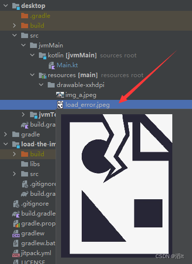
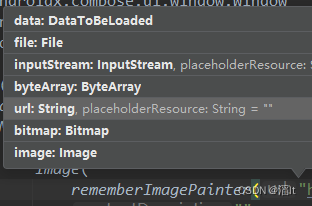
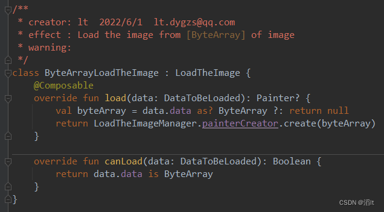

[简体中文](https://blog.csdn.net/qq_33505109/article/details/125194044)

# load-the-image

load-the-image Apply to compose-jb(desktop), Used to load network and local pictures.

<h1>Mode of use</h1>

Use the code load image with network, file, resources and more
```kotlin
//url="https://img.zcool.cn/community/017e625e57415ea801216518c25819.jpg@1280w_1l_2o_100sh.jpg"
Image(rememberImagePainter(url), "")
```

<h3>Add to your project</h3>

Step 1.Root dir, build.gradle.kts add:

```kotlin
buildscript {
    repositories {
        maven("https://jitpack.io")//this
        ...
    }
}
 
allprojects {
    repositories {
        maven("https://jitpack.io")//this
        ...
    }
}
```

Step 2.Your compose-desktop dir, build.gradle.kts add:

version = [](https://jitpack.io/#ltttttttttttt/load-the-image)

```kotlin
kotlin {
    sourceSets {
        val jvmMain by getting {
            dependencies {
                ...
                implementation("com.github.ltttttttttttt:load-the-image:$version")//this
            }
        }
    }
}
```

Step 3.Recommendation: uniformly configure the failure graph path displayed when loading fails

```kotlin
fun main() {
    LoadTheImageManager.defaultErrorImagePath = "drawable-xxhdpi/load_error.jpeg"//this
    application {
        Window(onCloseRequest = ::exitApplication) {
            MaterialTheme {
                Image(rememberImagePainter("https://img.zcool.cn/community/017e625e57415ea801216518c25819.jpg@1280w_1l_2o_100sh.jpg"),"")
            }
        }
    }
}
```

ps:Reference of Resource location, you can customize


<h1>Custom configuration</h1>

<h3>1.Configure placeholder and error image</h3>

You can use the default parameters in the method


Usage:

```kotlin
rememberImagePainter(url, /*the placeholder path*/)
```

Or:

```kotlin
    rememberImagePainter(DataToBeLoaded(url).apply {
        placeholderResource = /*the placeholder path*/
        errorImagePath = /*the error resource path*/
    })
```

<h3>2.Modify memory cache size</h3>

```kotlin
LoadTheImageManager.memoryCache = ImageLruMemoryCache(/*max memory cache size*/)
```

ps:Default memory cache size:maxOf(50MB, 1% of total memory)

You can customize:

```kotlin
LoadTheImageManager.memoryCache = /*your class*/
```

<h3>3.Modify file cache location</h3>

```kotlin
LoadTheImageManager.fileCache = ImageFileCache(File("C://test_dir"))
```

Or:

```kotlin
LoadTheImageManager.fileCache = /*your class*/
```

ps:Default file cache location: user\Pictures\LoadTheImageCache

<h3>4.Modify http loader</h3>

```kotlin
LoadTheImageManager.httpLoader = /*your class*/
```

<h3>5.Load-the-image supports multiple formats, And it can be expanded by itself</h3>



Custom reference below:

One.Implement your class:


Two.Configure:
```kotlin
LoadTheImageManager.loadTheImage.add(ByteArrayLoadTheImage()/*your class*/)
```

Three.Use:
```kotlin
rememberImagePainter(DataToBeLoaded(byteArrayOf()))//Better seal it
```

<h1>If you use compose(Kotlin Multiplatform), You can refer to the example.</h1>

version = [](https://jitpack.io/#ltttttttttttt/load-the-image)

Your common dir, build.gradle.kts add:

```
val desktopMain by getting{
	dependencies {
		implementation 'com.github.ltttttttttttt:load-the-image:$version'
	}
}
```

commonMain add function:

```
@Composable
expect fun rememberImagePainter(url: String): Painter
```

androidMain add function(and other target):

```
@Composable
actual fun rememberImagePainter(url: String): Painter =
    coil.compose.rememberImagePainter(data = url)
```

desktopMain add function:

```
@Composable
actual fun rememberImagePainter(url: String): Painter =
    com.lt.load_the_image.rememberImagePainter(url)
    
```
Use the code load image with network and file and resources

```
Image(rememberImagePainter(/*url*/"https://img.zcool.cn/community/017e625e57415ea801216518c25819.jpg@1280w_1l_2o_100sh.jpg","")
```
